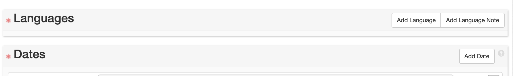
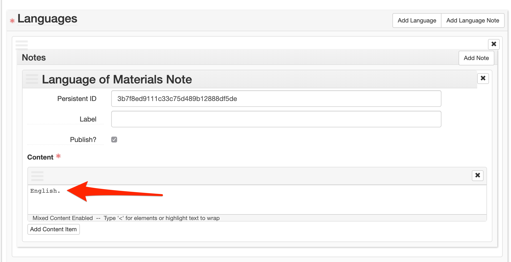
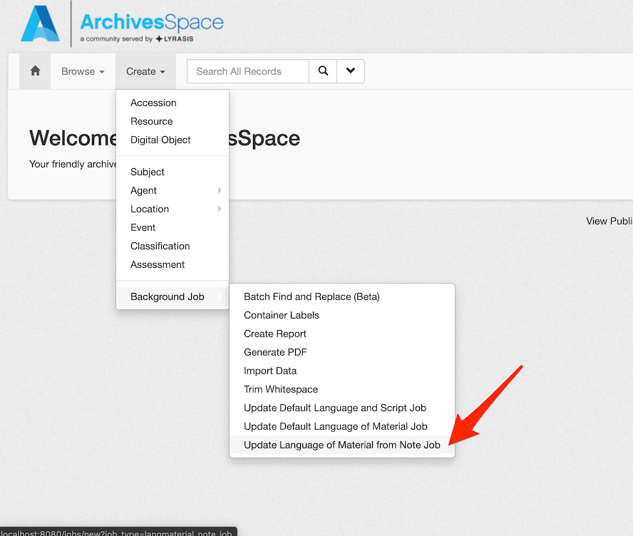
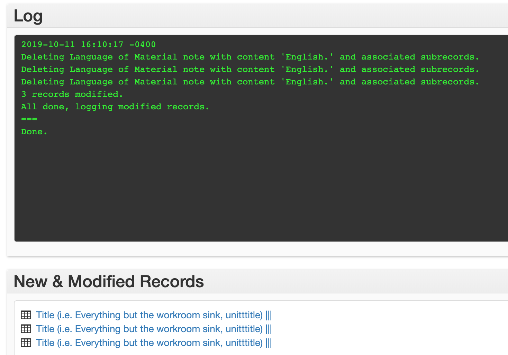
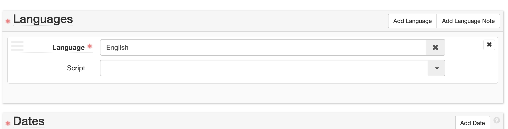

# batch_update_langmaterials_from_note

A plugin to batch update language of materials records for resource records currently lacking a controlled value language.

## Background

As of ArchivesSpace v2.7.0, users may record multiple languages and scripts of archival materials in Resource, Archival Object, Digital Object, and Digital Object Component records via dropdowns in a controlled value list, as well as a free-text note field.  These fields are located in the new Languages section of the relevant record types.

While a controlled value **Language of Material** is optional for Archival Object, Digital Object, and Digital Object Component records, it is now a **required** field for Resource records. The v2.7.0 upgrade includes database migrations to map existing language of material content to the new Language sub-record, however, while some ways of recording language information could be easily accommodated in this migration, some situations will require data cleanup. This is one of two plugins (also see: https://github.com/archivesspace-plugins/batch_update_langmaterials).

This plugin allows any user with manage_repository permissions or higher to initiate a background job that will:
1.  Identify Resource records lacking a controlled value language of material sub-note;
2.  that **do** contain a Language of Material text Note with specific user-specified content;
3.  generate a user-supplied controlled value language for all those records; and,
4.  (optionally) delete those existing Language of Material notes.

## Using the plugin

After installing the plugin (see below):

1.  *(Optional, but encouraged)* Review your post-migration records and identify one or a few trends in Language of Material notes that didn't cleanly migrate to controlled value language sub-records.

2.  While logged in as a repository manager or higher, create a new "Update Default Language of Material from Note" background job.

3.  Populate that "Language of Material note string" with an **exact match** (including spaces, punctuation, etc.) of the Language of Material note content you would like to match before generating new controlled value language sub-records.  
4.  Select the new controlled value language to be added to all Resource records lacking a controlled value language and containing a Language of Material note matching the string entered in step 3.

5.  *(Optional)* If logged in as a user with 'delete archival record' permissions, select the "Delete Language of Material note after update?" checkbox if you wish to delete all Language of Material notes matching the content you entered in step 3.
5.  *(Optional)* If logged in as a System Administrator, select the "Globally run update for all repositories?" checkbox if you wish to populate all Resource records currently lacking a controlled value Language of Material sub-record in every repository with the language selected in step 4.
6.  Submit the job and wait for the job to complete.

7.  After the job completes you may review a list of records updated as part of the background job.  (Note: If you opted to "Globally run" the background job some links in the update records section may lead to "Resource Not Found" pages as those links point to a repository other than the one you are currently logged in to.)

## To install:

1. Stop the application
2. Clone the plugin into the `archivesspace/plugins` directory
3. Add `batch_update_langmaterials_from_note` to `config.rb`, ensuring to uncomment/remove the # from the front of the relevant AppConfig line.  For example:
`AppConfig[:plugins] = ['local', 'batch_update_langmaterials_from_note']`
4. Restart the application
